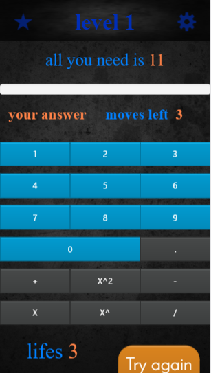
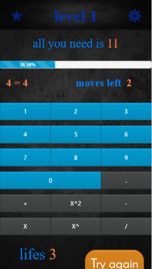
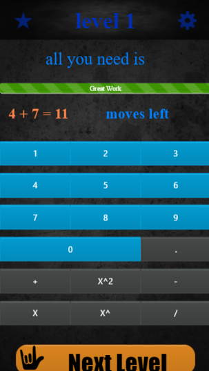

# MathIt-Einstain
app using Cordova Ionic Angular 1

The game is a math game that chalanged math skills and knowledge.

[Google play](https://play.google.com/store/apps/details?id=com.GoorL.MathIt)

 ->  -> 


## Install

- Android sdk 
- Java jdk 

### Run

```
$ cordova serve
```
